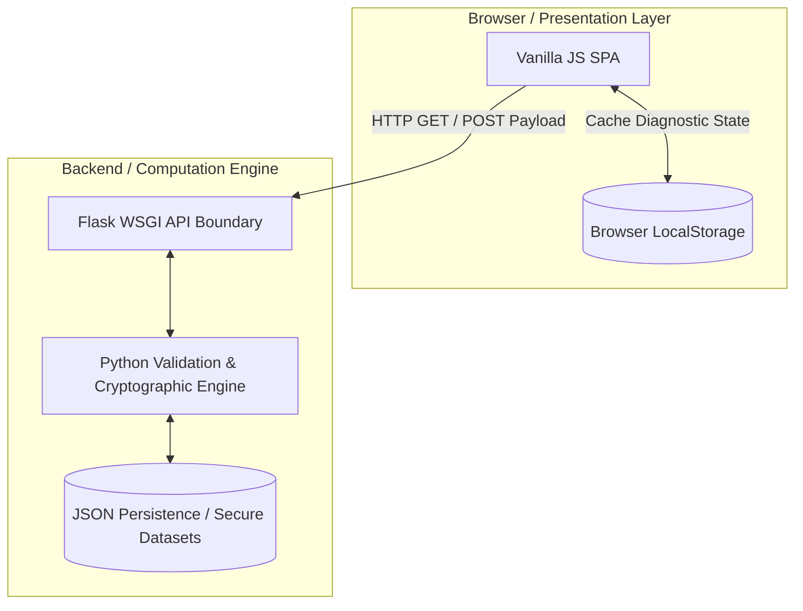

# DecodeLabs Industrial Training: Backend Architecture Portfolio


## Executive Summary

Welcome to my official engineering portfolio for the DecodeLabs Industrial Training Kit (Batch 2026).

This repository documents my comprehensive progression through the foundational and mastery phases of backend software engineering. The core objective of this training was to transition from writing isolated, monolithic scripts to engineering decoupled, fault-tolerant, and highly scalable systems.

This portfolio culminates in an API-driven Single Page Application (SPA), showcasing advanced data capture, input validation, state preservation, cryptographic integrity, and the strict decoupling of business logic from the presentation layer.

## System Architecture: The API-Driven Evolution

Throughout this training kit, the architecture evolved from a traditional Server-Side Rendered (SSR) model (Weeks 1-3) into a modern API-driven ecosystem (Week 4).



The Presentation Layer (Client): "Dumb" interfaces built with HTML, CSS, and Vanilla JS that strictly handle presentation, routing, and real-time DOM manipulation.

Client-Side Persistence: Utilizing browser localStorage to cache historical data and diagnostic reports, reducing server load and enabling localized history viewing.

The Transport Layer (API Boundary): The Flask WSGI layer serving as a secure gateway, decoding HTTP payloads and decoupling the UI completely from the backend engine.

The Computation Engine (Logic): The Python core acting as the "Validation Station," handling strict input sanitization, defensive coding algorithms, mathematical accumulators, and cryptographic functions.

The Persistence Layer (Storage): The permanent data destination, bypassing the "Volatile Trap" of temporary RAM via JSON serialization.

## The Engineering Milestones

### Phase 1: Advanced To-Do List Engine

Focus: Data Management, CRUD Operations & Persistence

Objective: Master the fundamental IPO (Input, Process, Output) Architecture.

Technical Specifications:

- Persistence: Implemented JSON Serialization (tasks.json) to ensure state survives server restarts.
- Decoupled Rendering: Separated Data Logic from the UI using Server-Side Rendering (SSR) via the Jinja2 templating engine.
- Functionality: Engineered full CRUD routing (Create, Read, Update, Delete), priority-based sorting algorithms, and automated datetime stamping.

### Phase 2: State-Preserving Financial Tracker

Focus: Data Accumulation & The Continuous Audit

Objective: Shift to dynamic, real-time data processing while maintaining systemic fault tolerance.

Technical Specifications:

- The Ledger Heartbeat: Engineered a state-preserving Accumulator Pattern (total += expense) that safely aggregates data in memory during continuous loop cycles.
- The Digital Poka-Yoke: Built robust input validation using try...except ValueError blocks to catch garbage payload data and prevent fatal runtime crashes.
- Control Flow: Implemented graceful shutdowns via Sentinel Values to finalize ledgers and commit data to storage.

### Phase 3: Enterprise Cryptographic Security Engine

Focus: Mathematical Security & Algorithmic Efficiency

Objective: Transition to cryptographic security and memory optimization, prioritizing efficiency over legacy complexity rules.

Technical Specifications:

- Hardware-Level Entropy: Bypassed the deterministic Mersenne Twister (random module) by implementing Python's secrets.choice() for cryptographically secure pseudo-random number generation (CSPRNG).
- Linear Time Complexity ($O(N)$): Eliminated the $O(N^2)$ memory bottleneck of immutable string concatenation (+=) by utilizing list comprehension and "".join() to allocate heap memory exactly once.
- Entropy Validation: Implemented real-time mathematical validation ($E = L \times \log_2(R)$) to calculate cryptographic strength in bits, aligning with NIST SP 800-63-4 guidelines.

### Phase 4: API-Driven Knowledge Engine

Focus: Event-Driven Design, Control Flow & SPA Architecture

Objective: Architect a fully decoupled, data-driven diagnostic engine utilizing RESTful API principles and client-side persistence.

Technical Specifications:

- Data-Driven Logic: Transitioned from hardcoded if/else blocks to a scalable, dictionary-based Question Bank processing inputs via an evaluation loop.
- API Decoupling: Replaced SSR with strict JSON endpoints (/api/questions, /api/evaluate) to serve a multi-view Vanilla JS frontend.
- Advanced Sanitization: Implemented aggressive Regex and string normalization (.strip().lower()) to eliminate false failures from chaotic human inputs.
- State Management: Handled live MCQ form state via JS and archived historical attempt metrics persistently using localStorage.

## API Route Documentation Matrix

| Phase | Endpoint | HTTP Method | Payload/Params | Core Function |
| --- | --- | --- | --- | --- |
| Week 1 | /add | POST | task_name, priority | Appends new entity to dataset; assigns unique ID. |
| Week 1 | /complete/<id> | GET | task_id (int) | Toggles boolean completion status in storage. |
| Week 1 | /delete/<id> | GET | task_id (int) | Drops entity from dataset via list comprehension. |
| Week 2 | /process | POST | amount, description | Validates float conversion; accumulates total state. |
| Week 3 | / | POST | length, toggles | Cryptographic generation and entropy calculation logic. |
| Week 4 | /api/questions | GET | None | Returns sanitized MCQ dataset (strips correct answers). |
| Week 4 | /api/evaluate | POST | JSON Object | Evaluates answers, calculates advanced grading metrics. |

## Security Posture & Vulnerability Mitigation

- Data Leakage Prevention: The Phase 4 /api/questions endpoint strictly strips the valid_answers array before transmitting the payload to the client, preventing browser-side manipulation or cheating.
- Injection Prevention: All user inputs rendered to the DOM are automatically escaped via Flask/Jinja2 and Vanilla JS sanitization functions to mitigate Cross-Site Scripting (XSS) attacks.
- Type-Safety Enforcement: Strict server-side type casting and ValueError trapping prevent malformed data from corrupting the JSON persistence layer.
- Cryptographic Predictability: Eradicated pseudo-random vulnerabilities by strictly enforcing the hardware-level secrets module for secure generation tasks.

## Core Competencies Acquired

| Domain | Skills & Methodologies |
| --- | --- |
| Backend Logic | Python 3, Flask Routing, IPO Architecture, Sentinel Values, API Decoupling |
| Data Engineering | JSON Serialization, Accumulator Patterns, Data State Preservation, Dict Mapping |
| Security & Math | CSPRNG (secrets), Information Entropy, Defensive Coding (Error Handling) |
| Optimization | Time/Space Complexity Management, Big O Notation ($O(N)$ memory allocation) |
| Frontend/UI | HTML5, CSS3 Custom Properties, Glassmorphism, JS SPA Routing, LocalStorage |

## Repository Structure

```text
DecodeLabs-Internship/
│
├── Week 1/ (Data Management & CRUD)
│   ├── app.py
│   ├── tasks.json
│   ├── static/style.css
│   └── templates/index.html
│
├── Week 2/ (Data Accumulation & Poka-Yoke)
│   ├── app.py
│   ├── ledger.json
│   ├── static/style.css
│   └── templates/index.html
│
├── Week 3/ (Cryptographic Security & Big O)
│   ├── app.py
│   ├── static/style.css
│   └── templates/index.html
│
└── Week 4/ (Control Flow & API-Driven SPA)
	 ├── app.py
	 ├── static/style.css
	 └── templates/index.html
```

## Local Deployment Guide

System Requirements:

- Python 3.10+
- pip (Python Package Installer)

1. Clone the environment:

	```bash
	git clone https://github.com/ahsanur-official/DecodeLabs-Internship.git
	cd DecodeLabs-Internship
	```

2. Isolate dependencies (Optional but recommended):

	```bash
	python -m venv venv
	source venv/bin/activate  # On Windows: venv\Scripts\activate
	```

3. Install requirements:

	```bash
	pip install flask
	```

4. Spin up the WSGI Server (Example: Phase 4):

	```bash
	cd "Week 4"
	python app.py
	```

5. Access the Client Interface:

	Open your browser and connect to: http://127.0.0.1:5000

## Engineering Identity & Developer Profile

Md. Ahsanur Rahaman

Computer Science & Engineering (CSE) Undergraduate at Pundra University of Science & Technology (PUB).

Based in Bogura, Bangladesh.

Engineering Philosophy: Specializing in bridging robust, fault-tolerant Python backend architectures with high-fidelity, graphic-design-driven frontend web experiences.

GitHub: @ahsanur-official

Developed strictly under the architectural guidelines of the DecodeLabs Industrial Engineering track. Built with transparency, utilizing technical documentation and AI tools to aggressively debug and accelerate systemic understanding.
