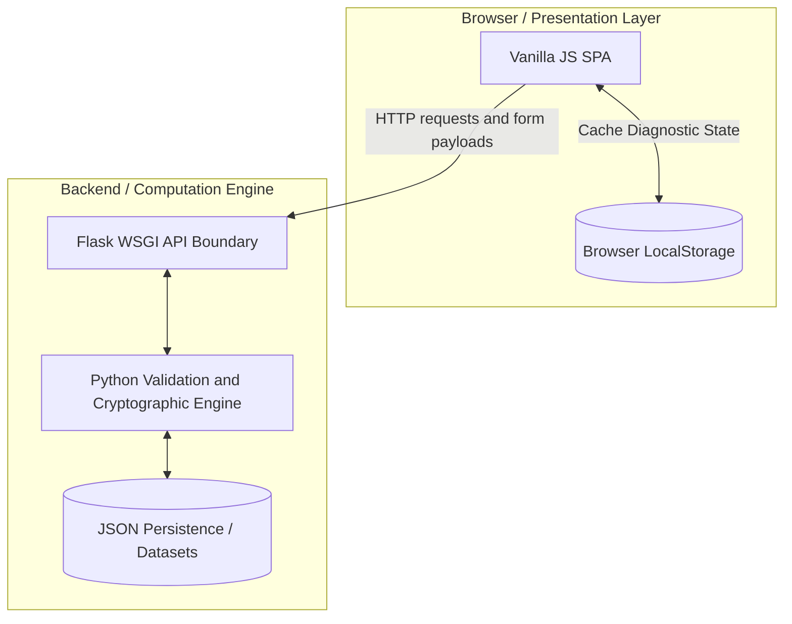

# DecodeLabs Internship Portfolio


## Overview

This repository contains my DecodeLabs industrial training projects for Batch 2026. It documents the progression from simple server-rendered applications to a more decoupled, API-driven single page application.

The portfolio focuses on backend fundamentals, validation, persistence, input handling, state management, and presentation-layer separation. Each week builds on the previous one and highlights a different engineering concept.

## Architecture Progression

The training moved from a traditional server-side rendered model in Weeks 1 to 3 toward a modern API-driven approach in Week 4.



### Layer Summary

- Presentation layer: HTML, CSS, and Vanilla JavaScript interfaces responsible for display, routing, and DOM updates.
- Client-side persistence: browser localStorage is used to cache history and diagnostic data.
- Transport layer: Flask acts as the API boundary and decouples the UI from backend logic.
- Computation engine: Python handles validation, defensive logic, scoring, password generation, and response formatting.
- Persistence layer: JSON files store application state between runs.

## Weekly Projects

### Week 1: To-Do Web Server

Focus: data management, CRUD operations, and persistence.

Key features:

- JSON persistence with `tasks.json`.
- Full CRUD flow: create, read, update, delete.
- Priority-based task ordering.
- Date stamping for newly created tasks.
- Server-side rendering with Flask and Jinja2.

### Week 2: Expense Tracker

Focus: data accumulation and input validation.

Key features:

- Stateful ledger storage in `ledger.json`.
- Running total management with an accumulator pattern.
- Transaction history tracking.
- Validation with `try...except ValueError` to block invalid input.
- Flash messages for success, error, and finalization events.

### Week 3: Enterprise Password Generator

Focus: cryptographic strength, entropy, and secure generation.

Key features:

- Secure random password generation with `secrets`.
- Character set selection for uppercase, lowercase, digits, and symbols.
- Length validation between 8 and 128 characters.
- Entropy calculation using `math.log2`.
- Strength labels that classify passwords from weak to enterprise-grade.

### Week 4: Knowledge Diagnostic

Focus: control flow, API design, and SPA behavior.

Key features:

- API endpoint that serves quiz questions as JSON.
- Evaluation endpoint that scores user answers.
- Input normalization and safe answer comparison.
- Category-based performance breakdown.
- Result payload with score, grade, feedback, weak categories, and recommendations.
- Vanilla JavaScript frontend with localStorage support for cached state.

## Repository Structure

```text
DecodeLabs-Internship/
├── Week 1/
│   ├── app.py
│   ├── tasks.json
│   ├── static/style.css
│   └── templates/index.html
├── Week 2/
│   ├── app.py
│   ├── ledger.json
│   ├── static/style.css
│   └── templates/index.html
├── Week 3/
│   ├── app.py
│   ├── static/style.css
│   └── templates/index.html
├── Week 4/
│   ├── app.py
│   ├── static/style.css
│   └── templates/index.html
└── README.md
```

## Local Setup

Requirements:

- Python 3.10 or later
- pip

Steps:

1. Clone the repository.

   ```bash
   git clone https://github.com/ahsanur-official/DecodeLabs-Internship.git
   cd DecodeLabs-Internship
   ```

2. Create and activate a virtual environment.

   ```bash
   python -m venv venv
   # Windows
   venv\Scripts\activate
   ```

3. Install Flask.

   ```bash
   pip install flask
   ```

4. Run the week you want to test. For example, Week 4:

   ```bash
   cd "Week 4"
   python app.py
   ```

5. Open the app in your browser.

   ```text
   http://127.0.0.1:5000
   ```

## Developer Profile

Md. Ahsanur Rahaman

- Computer Science and Engineering undergraduate at Pundra University of Science and Technology (PUB).
- Based in Bogura, Bangladesh.
- Engineering philosophy: building robust, fault-tolerant Python backend systems with carefully designed frontend experiences.
- GitHub: @ahsanur-official

## Notes

- The project was developed under the DecodeLabs industrial training guidelines.
- The codebase demonstrates progression across persistence, validation, cryptography, and API-driven UI design.